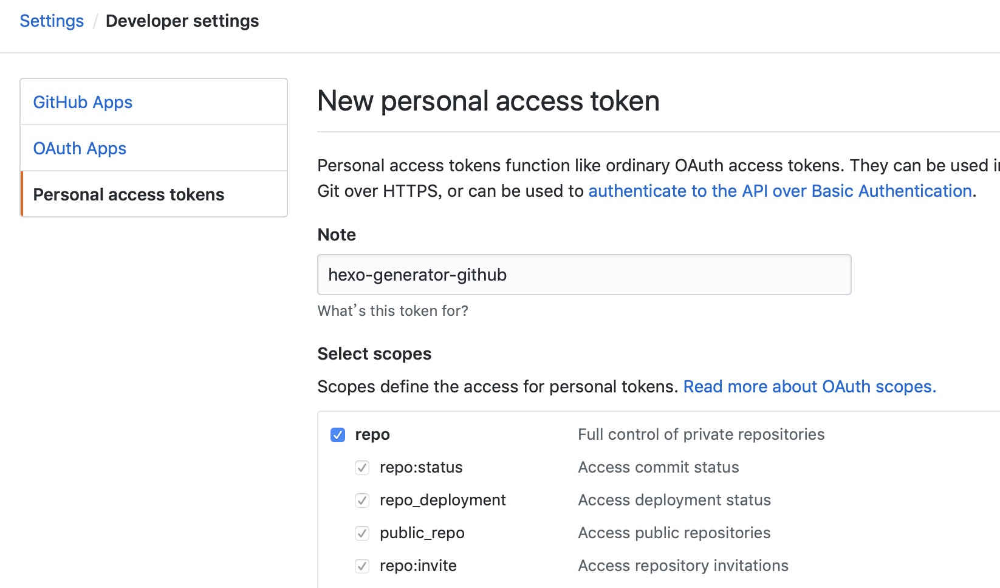

## hexo-generator-github

[](https://travis-ci.org/Jamling/hexo-generator-github)
[](https://www.npmjs.com/package/hexo-generator-github)
[](https://www.npmjs.com/package/hexo-generator-github)
[](https://www.npmjs.com/package/hexo-generator-github)
[](https://github.com/Jamling/hexo-generator-github/releases/latest)

A generator used to generate page for [Hexo] from your exists Github project file.

## Installation

``` bash
$ npm install hexo-generator-github --save
```

## Usage

hexo-generator-github can be used as helper/generator/console plugin. `hexo server` and `hexo generate` will call the generator of this plugin; A console command is provided to run this generator.

``` bash
$ hexo github [-r --replace]
```

If `-r` or `--replace` option assigned, the generator will call github api and replace the existing github contents cache.

## Config

``` yaml
github:
  debug: true # enable debug to log github api request/response
  user: Jamling # your github user name
  timeout: 60000 # set the github api request timeout
  token: your_token # enable Authorization for github api request, the api request limit will grow up from 60 to 5000
  cache_dir: gh_cache # the response of github api will store under the directory.
  repos: # request following repositories, otherwise, all repositories (limit 100) of user will be requested.
    - SmartIM4Eclipse
    - SmartIM4IntelliJ
    - hexo-theme-nova
    - hexo-generator-i18n
    - hexo-generator-github
    - hexo-generator-index2
    - hexo-filter-highlight
    - Android-ORM
    - eclipse-explorer
    - QuickAF
  navs: # project page left default nav menu, you can config for each project in ${blog}/_data/projects.yml
    overview: index.html
    index: index.html
    start: start.html
    release: release.html
    download: download.html
    userguide: userguide.html
    change: change.html

```

- **debug**: Whether print debug info
- **cache_dir**: Github response cache dir, you can run `hexo github -r` to remove all cache or remove files in cache manually to refresh cache again
- **user**: Github user name
- **repos**: Result repositories, return all(limit 100) repositories of user if **undefined** in <var>_config.yml</var> 
- **token**: See  to generate token to grown up github api request limitation

## Front-matter
A `gh` front-matter is nessary in your page to generate github response.

- gh.user the github user, default is github.user in <var>_config.yml</var>, see [gh_opts](#gh_opts)
- gh.repo the github repo, default is fetched from url, see [gh_opts](#gh_opts)
- gh.type 
    - get_repos get repositories from github, see [gh_repos](#gh_repos)
    - get_contents get markdown file under repository, see [gh_contents](#gh_contents)
    - get_releases get releases under repository, see [gh_releases](#gh_releases)

## Helpers

### gh_opts
Return full <var>page.gh</var>.
If no user assigned in page gh front-matter, the user will set from <var>hexo.config.github.user</var>
If no repo assigned in page gh front-matter, the repo will set from <var>page.path</var>
Sample:

- page.path = p/Android-ORM/ => gh.repo = Android-ORM
- page.path = en/p/Android-ORM/ => gh.repo = Android-ORM (The <var>hexo.config.language</var> must contains **en** in <var>_config.yml</var>)

### gh_repos

Return array of github user's repos

``` htmlbars
  
    <!--<div class="col-sx-6 col-sm-6 col-md-6 col-lg-6">-->
      <div class="panel panel-default project">
        <div class="panel-heading">
          <h3>
            <span class="icon nova-repo black-text"></span>
            <a href="./{{ p.name }}" target="_blank" title="{{p.name}}"> {{ p.name }}</a>
            <a href="https://github.com/{{p.owner.login}}/{{p.name}}" target="_blank" title="view on github"><span aria-hidden="true" class="icon nova-github right black-text"></span></a>
          </h3>
        </div>
        <div class="panel-body">
          <p>{{ p.description }}</p>
        </div>
        <div class="panel-footer">
          <iframe src="https://ghbtns.com/github-btn.html?user={{p.owner.login}}&repo={{p.name}}&&type=star&count=true" class="github-iframe" height="20" width="110"></iframe>
          <iframe src="https://ghbtns.com/github-btn.html?user={{p.owner.login}}&repo={{p.name}}&&type=fork&count=true" class="github-iframe" height="20" width="110"></iframe>
        </div>
      </div>
    <!--</div>-->
  

```

Option | Description | Default
--- | --- | ---
`user` | Github user | <var>config.github.user</var>

### gh_contents

Return github (**markdown file**) contents of repository

``` js

```
So the page content will be replaced of content of github.

Option | Description | Default
--- | --- | ---
`user` | Github user | <var>config.github.user</var>
`repo` | Github repo | <var>page.gh.repo</var>
`path` | Github content path | README
`ref` | Github reference | master

### gh_releases

Return array of github repo releases

``` htmlbars

<div class="release">
  <div class="header">
    <a href="{{p.html_url}}">{{p.name}}</a>
    <a href="{{p.author.html_url}}">{{p.author.login}}</a> released this on {{gh_time(p.published_at)}}
  </div>
  <div class="markdown-body">
    {{markdown(p.body)}}
  </div>
  <h2 class="release-downloads-header">Downloads</h2>
  <ul class="release-downloads">
    
    <li><a href="{{d.browser_download_url}}">
      <strong>{{d.name}}</strong> ({{d.download_count}} downloads)</a>
    </li>
    
  </ul>
</div>

```

Option | Description | Default
--- | --- | ---
`user` | Github user | <var>config.github.user</var>
`repo` | Github repo | <var>page.gh.repo</var>

### gh_edit_link

Return edit link string of github contents

``` js
{{ gh_edit_link() }}
```

### gh_aside_nav

Return project content navigator tree

``` js
      $('#project_tree').treeview({
        enableLinks: true,
        color: '#428bca',
        expandIcon: 'icon nova-arrow-right2',
        collapseIcon: 'icon nova-arrow-down2',
        //levels: 3,
        //node-icon: '',
        //selectedColor: '#ff0000',
        onNodeSelected: function(event, data) {
          if (data.state.selected){
            return;
          }
        },
        data: {{ gh_aside_nav({parent_color:'#337ab7'}) }}
      });
```

Option | Description | Default
--- | --- | ---
`user` | Github user | <var>config.github.user</var>
`repo` | Github repo | <var>page.gh.repo</var>
`path` | Github content path | README
`ref` | Github reference | master

## Reference

- [Github Developer](https://developer.github.com/): see more properties of github response.
- [hexo-theme-nova](https://github.com/Jamling/hexo-theme-nova): the nova theme used this plugin to generate project pages.

## License

MIT

[Hexo]: http://hexo.io/
